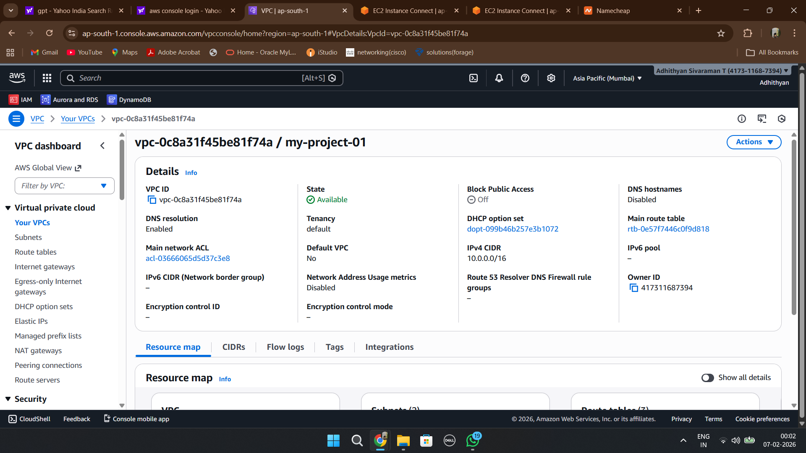
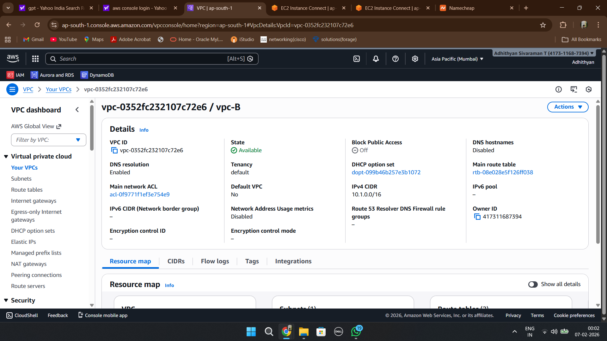
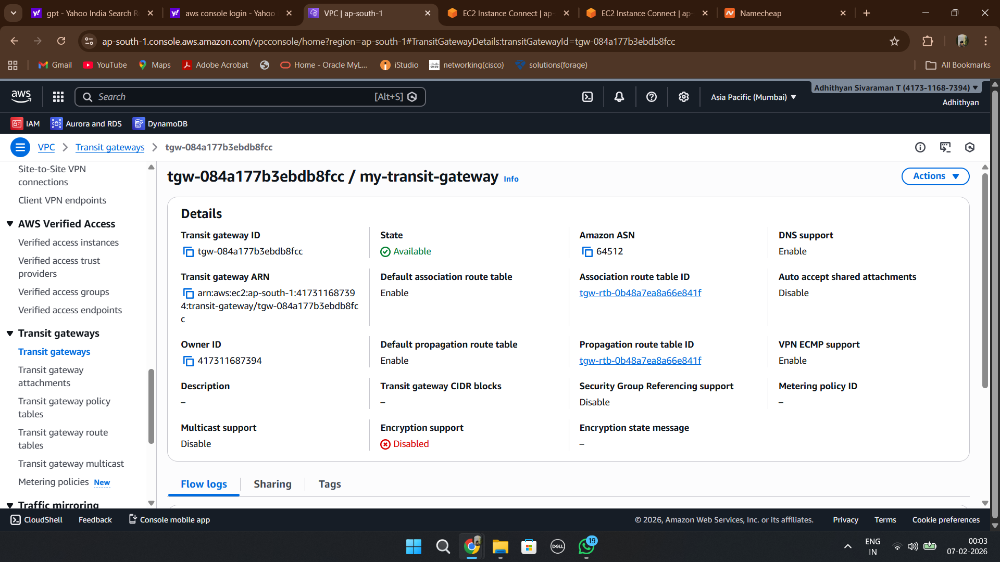
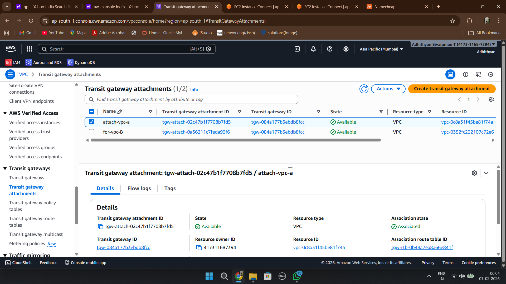
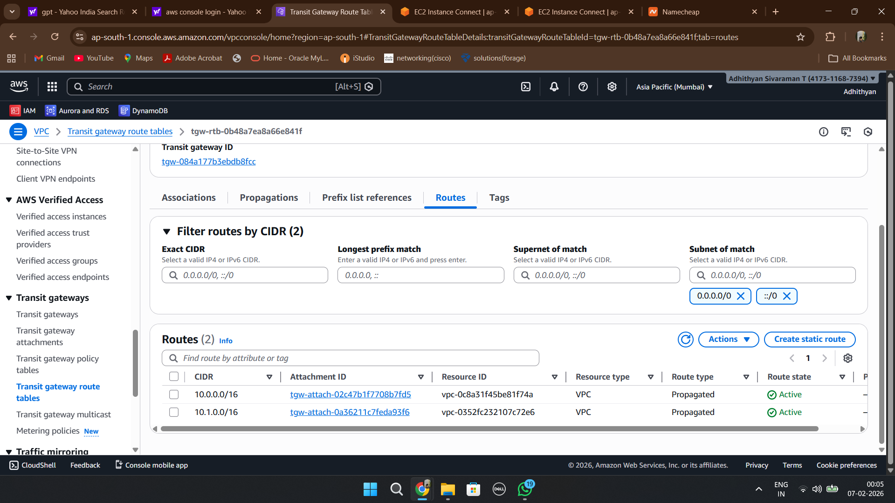
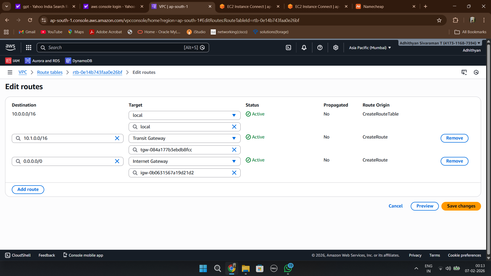
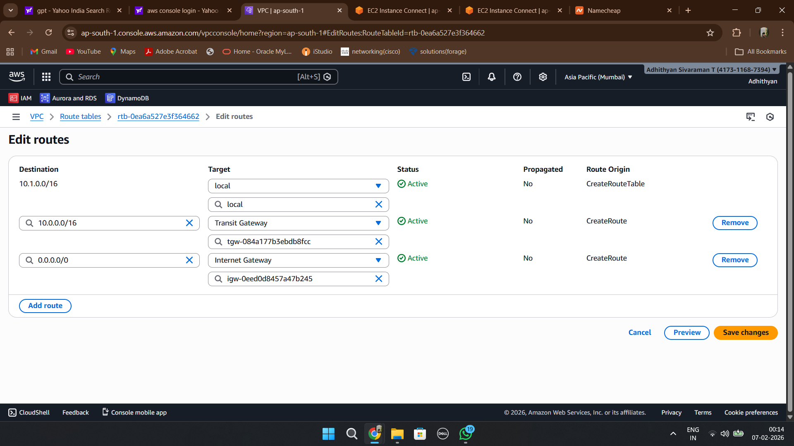
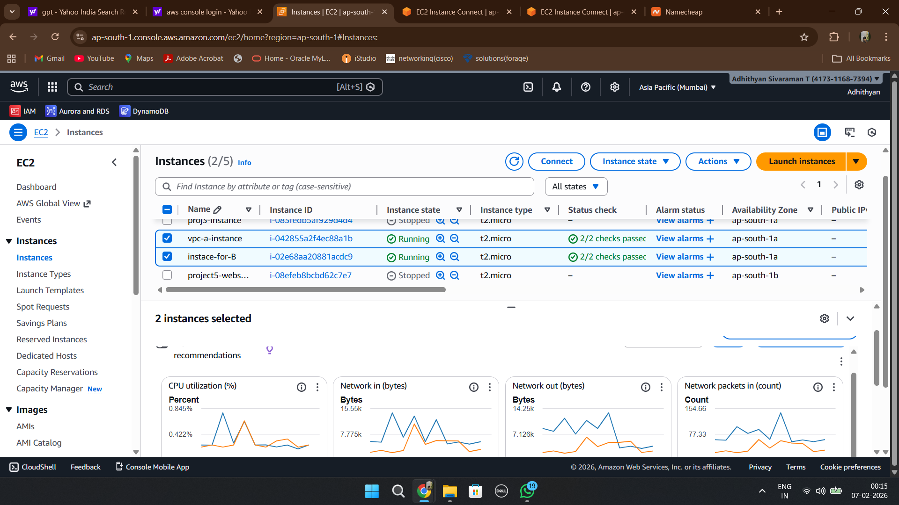
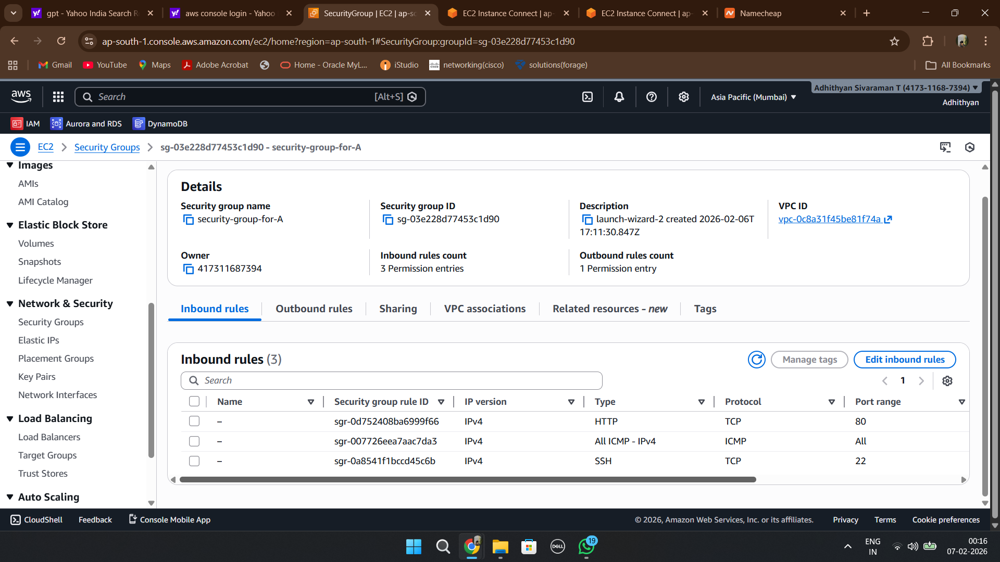
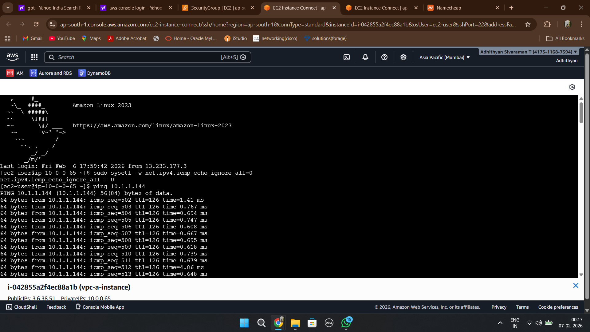

# 🚀 Implementation Walkthrough

This document explains the complete implementation process used to establish private communication between two Amazon VPCs using AWS Transit Gateway.

---

# Step 1 – Create VPC-A

Created the first VPC with CIDR:

10.0.0.0/16

This VPC hosts the first EC2 instance.



---

# Step 2 – Create VPC-B

Created a second VPC with CIDR:

10.1.0.0/16

This VPC hosts the second EC2 instance.



---

# Step 3 – Create AWS Transit Gateway

Created an AWS Transit Gateway to act as the central routing hub between multiple VPCs.

Benefits:

- Centralized connectivity
- Hub-and-spoke architecture
- Simplified route management
- Scalable networking



---

# Step 4 – Attach Both VPCs to Transit Gateway

Created Transit Gateway attachments for:

- VPC-A
- VPC-B

This enables both VPCs to communicate through the Transit Gateway.



---

# Step 5 – Verify Transit Gateway Route Propagation

Verified that both VPC CIDR ranges were propagated into the Transit Gateway Route Table.

Observed routes:

- 10.0.0.0/16
- 10.1.0.0/16



---

# Step 6 – Configure VPC-A Route Table

Added a route:

Destination: 10.1.0.0/16

Target: Transit Gateway

This allows traffic from VPC-A to reach VPC-B.



---

# Step 7 – Configure VPC-B Route Table

Added a route:

Destination: 10.0.0.0/16

Target: Transit Gateway

This allows traffic from VPC-B to reach VPC-A.



---

# Step 8 – Launch EC2 Instances

Launched one EC2 instance in each VPC.

Instances:

- vpc-a-instance
- instance-for-B

These instances were used to validate cross-VPC communication.



---

# Step 9 – Configure Security Groups

To validate connectivity using ping, ICMP traffic was allowed in the Security Groups attached to both EC2 instances.

Rules configured:

- SSH (22)
- HTTP (80)
- All ICMP - IPv4



---

# Step 10 – Enable ICMP Response

Executed the following command on the EC2 instances:

```bash
sudo sysctl -w net.ipv4.icmp_echo_ignore_all=0
```

This ensures that the operating system responds to ICMP echo requests.

---

# Step 11 – Validate Connectivity

From the EC2 instance in VPC-A, a ping test was performed to the private IP address of the EC2 instance in VPC-B.

Command used:

```bash
ping <private-ip-of-vpc-b-instance>
```

Successful responses confirmed:

- Transit Gateway routing is working
- Route tables are correctly configured
- Security Groups permit ICMP traffic
- Multi-VPC communication is established



---

# Project Outcome

✅ Created two isolated VPCs

✅ Connected both VPCs using AWS Transit Gateway

✅ Configured Transit Gateway attachments

✅ Implemented cross-VPC routing

✅ Validated successful EC2-to-EC2 communication

✅ Demonstrated enterprise-grade hub-and-spoke networking architecture

✅ Established private communication using Transit Gateway
